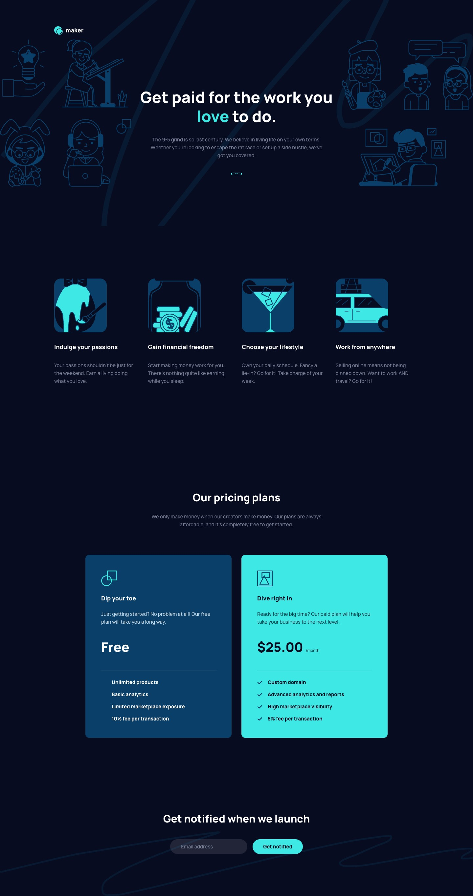
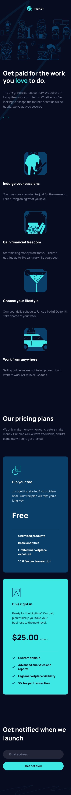

# Frontend Mentor - Maker pre-launch landing page solution

This is a solution to the [Maker pre-launch landing page challenge on Frontend Mentor](https://www.frontendmentor.io/challenges/maker-prelaunch-landing-page-WVZIJtKLd). Frontend Mentor challenges help you improve your coding skills by building realistic projects.

## Table of contents

- [Overview](#overview)
  - [The challenge](#the-challenge)
  - [Screenshots](#screenshots)
  - [Links](#links)
- [My process](#my-process)
  - [Built with](#built-with)
  - [What I learned](#what-i-learned)
  - [Continued development](#continued-development)
  - [Useful resources](#useful-resources)
  - [AI Collaboration](#ai-collaboration)
- [Author](#author)

## Overview

### The challenge

Users should be able to:

- View the optimal layout depending on their device's screen size
- See hover states for interactive elements
- Receive an error message when the form is submitted if:
  - The `Email address` field is empty should show "Oops! Please add your email"
  - The email is not formatted correctly should show "Oops! That doesn't look like an email address"

### Screenshots





### Links

- Solution URL: [GitHub Repository](https://github.com/gusanchefullstack/fsdev-maker-pre-launch-landing-page)
- Live Site URL: [https://fsdev-maker-pre-launch-landing-page.vercel.app](https://fsdev-maker-pre-launch-landing-page.vercel.app)

## My process

### Built with

- Semantic HTML5 markup (`header`, `main`, `section`, `article`, `footer`)
- CSS Modules for scoped component styling
- CSS Custom Properties (design tokens) for colors, typography and spacing
- Flexbox and CSS Grid for layouts
- Responsive design: mobile (375px), tablet (768px), desktop (1440px)
- [React 19](https://react.dev/) with TypeScript
- [Vite](https://vitejs.dev/) as build tool and dev server
- [Vitest](https://vitest.dev/) + [Testing Library](https://testing-library.com/) for unit tests

### What I learned

**CSS Modules with design tokens** — Combining CSS Modules for scoped component styles with CSS custom properties defined globally made it easy to maintain consistency across all components while preventing style leakage:

```css
/* variables.css — single source of truth */
:root {
  --color-cyan-400: #3EE9E5;
  --spacing-400: 16px;
  --text-preset-1-size: clamp(2rem, 4vw, 4rem);
}
```

**Accessible form validation** — Using `aria-invalid`, `aria-describedby`, and `role="status"` with `aria-live="polite"` ensures screen readers announce validation errors without interrupting the user. `role="status"` pairs correctly with `aria-live="polite"` — using `role="alert"` would create a conflicting assertiveness level:

```tsx
<input
  aria-invalid={error ? 'true' : 'false'}
  aria-describedby={error ? 'email-error' : undefined}
/>
<p id="email-error" role="status" aria-live="polite" aria-atomic="true">
  {error ? errorMessages[error] : ''}
</p>
```

**Importing from `vitest/config`** — When using Vite with Vitest, importing `defineConfig` from `vitest/config` (rather than `vite`) properly exposes the `test` property on the config type, preventing TypeScript build errors in CI/CD pipelines.

### Continued development

- Explore CSS `@layer` for better cascade management alongside CSS Modules
- Add end-to-end tests with Playwright for form submission flows
- Investigate CSS container queries as a complement to media queries

### Useful resources

- [Vitest Docs](https://vitest.dev/config/) — Essential for understanding the `defineConfig` integration with Vite
- [MDN ARIA — aria-describedby](https://developer.mozilla.org/en-US/docs/Web/Accessibility/ARIA/Attributes/aria-describedby) — Key reference for accessible form error patterns
- [CSS Modules documentation](https://github.com/css-modules/css-modules) — Helped clarify composition and scoping rules

### AI Collaboration

This project was built in collaboration with **Claude (Anthropic)** using Claude Code CLI.

- **Tools used**: Claude Sonnet 4.6 via Claude Code CLI, Figma MCP plugin for design extraction
- **How it was used**:
  - Extracted exact design tokens (colors, spacing, typography) directly from the Figma file using the Figma MCP plugin
  - Generated the full component architecture, CSS modules, and TypeScript types
  - Debugged the Vercel build failure (`defineConfig` import issue) and resolved the TypeScript error
  - Wrote all 21 Vitest unit tests for components and form validation
- **What worked well**: Using the Figma MCP plugin to read pixel-perfect values directly from the design file eliminated guesswork and manual spec-reading
- **What didn't**: The browser extension couldn't access localhost for visual verification, so tests and TypeScript type-checking served as the primary correctness signal during development

## Author

[](https://www.linkedin.com/in/gustavosanchezgalarza/) [](https://github.com/gusanchefullstack) [](https://hashnode.com/@gusanchedev) [](https://x.com/gusanchedev) [](https://bsky.app/profile/gusanchedev.bsky.social) [](https://www.freecodecamp.org/gusanchedev) [](https://www.frontendmentor.io/profile/gusanchefullstack)
